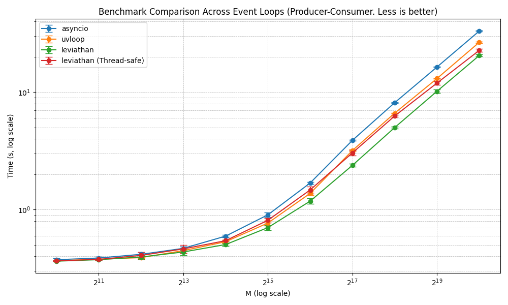
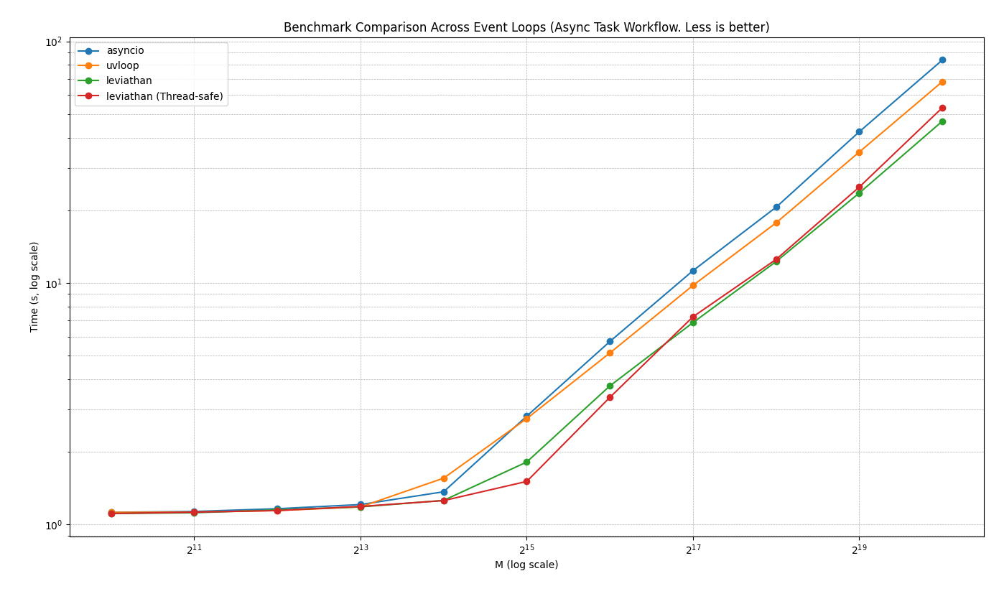
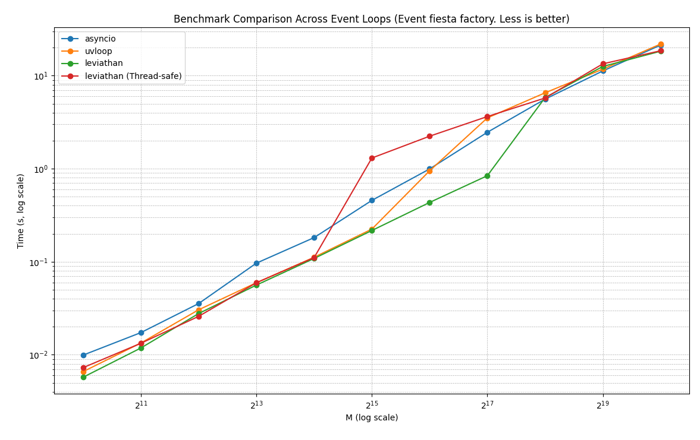
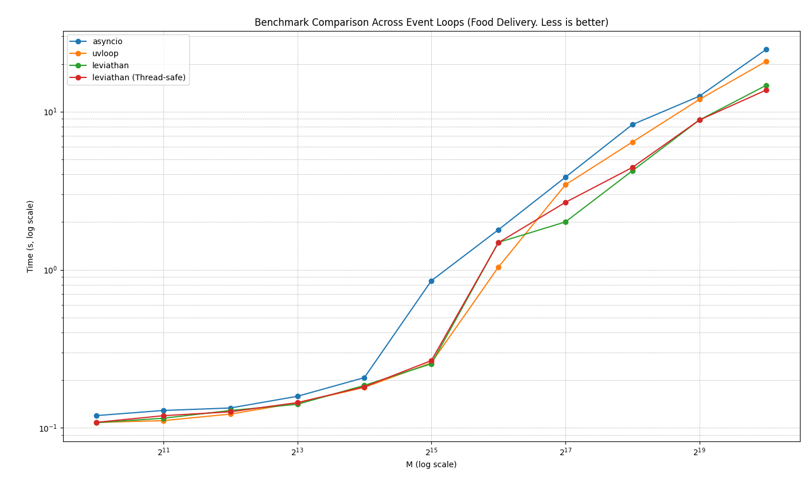

# Leviathan Benchmarking Results

This page presents the benchmarking results for Leviathan, showcasing its performance and efficiency compared to other event loops. The tests compare the implementation of the asyncio standard event loop, uvloop, Leviathan (single thread mode) and Leviathan (thread-safe).

### Test Environment

- **CPU**: 12th Gen Intel(R) Core(TM) i7-1255U
- **Operating System**: Linux Kernel 6.12.6-zen1-1-zen

---

## Benchmark Tests

### Test 1: Producer - Consumer

For more information, refer to the [code repository](benchmarks/producer_consumer.py).

```
+-------------------------+---------+--------------+------------+----------------+
|           Loop          |    M    | Avg Time (s) |  Diff (s)  | Relative Speed |
+-------------------------+---------+--------------+------------+----------------+
|         asyncio         |   1024  |   0.369277   |  0.000000  |      1.00      |
|         asyncio         |   2048  |   0.383231   |  0.000000  |      1.00      |
|         asyncio         |   4096  |   0.429600   |  0.000000  |      1.00      |
|         asyncio         |   8192  |   0.449880   |  0.000000  |      1.00      |
|         asyncio         |  16384  |   0.630501   |  0.000000  |      1.00      |
|         asyncio         |  32768  |   0.933108   |  0.000000  |      1.00      |
|         asyncio         |  65536  |   1.717241   |  0.000000  |      1.00      |
|         asyncio         |  131072 |   3.943848   |  0.000000  |      1.00      |
|         asyncio         |  262144 |   8.303788   |  0.000000  |      1.00      |
|         asyncio         |  524288 |  16.490572   |  0.000000  |      1.00      |
|         asyncio         | 1048576 |  33.126908   |  0.000000  |      1.00      |
|          uvloop         |   1024  |   0.365012   | -0.004265  |      1.01      |
|          uvloop         |   2048  |   0.374952   | -0.008279  |      1.02      |
|          uvloop         |   4096  |   0.388118   | -0.041482  |      1.11      |
|          uvloop         |   8192  |   0.415114   | -0.034766  |      1.08      |
|          uvloop         |  16384  |   0.476625   | -0.153876  |      1.32      |
|          uvloop         |  32768  |   0.705225   | -0.227883  |      1.32      |
|          uvloop         |  65536  |   1.356041   | -0.361200  |      1.27      |
|          uvloop         |  131072 |   3.199794   | -0.744054  |      1.23      |
|          uvloop         |  262144 |   6.726380   | -1.577407  |      1.23      |
|          uvloop         |  524288 |  13.353905   | -3.136667  |      1.23      |
|          uvloop         | 1048576 |  27.243566   | -5.883342  |      1.22      |
|        leviathan        |   1024  |   0.361633   | -0.007644  |      1.02      |
|        leviathan        |   2048  |   0.381657   | -0.001574  |      1.00      |
|        leviathan        |   4096  |   0.388655   | -0.040945  |      1.11      |
|        leviathan        |   8192  |   0.408746   | -0.041135  |      1.10      |
|        leviathan        |  16384  |   0.467260   | -0.163241  |      1.35      |
|        leviathan        |  32768  |   0.605296   | -0.327811  |      1.54      |
|        leviathan        |  65536  |   1.021888   | -0.695353  |      1.68      |
|        leviathan        |  131072 |   2.248688   | -1.695159  |      1.75      |
|        leviathan        |  262144 |   4.860199   | -3.443588  |      1.71      |
|        leviathan        |  524288 |   9.252936   | -7.237636  |      1.78      |
|        leviathan        | 1048576 |  19.402438   | -13.724470 |      1.71      |
| leviathan (Thread-safe) |   1024  |   0.362812   | -0.006466  |      1.02      |
| leviathan (Thread-safe) |   2048  |   0.376607   | -0.006623  |      1.02      |
| leviathan (Thread-safe) |   4096  |   0.393244   | -0.036356  |      1.09      |
| leviathan (Thread-safe) |   8192  |   0.412121   | -0.037759  |      1.09      |
| leviathan (Thread-safe) |  16384  |   0.474595   | -0.155906  |      1.33      |
| leviathan (Thread-safe) |  32768  |   0.606064   | -0.327044  |      1.54      |
| leviathan (Thread-safe) |  65536  |   1.029516   | -0.687725  |      1.67      |
| leviathan (Thread-safe) |  131072 |   2.411932   | -1.531916  |      1.64      |
| leviathan (Thread-safe) |  262144 |   4.929716   | -3.374072  |      1.68      |
| leviathan (Thread-safe) |  524288 |   9.928703   | -6.561869  |      1.66      |
| leviathan (Thread-safe) | 1048576 |  19.883143   | -13.243764 |      1.67      |
+-------------------------+---------+--------------+------------+----------------+
-
```



---

### Test 2: Task Workflow

For more information, refer to the [code repository](benchmarks/task_workflow.py).

```
+-------------------------+---------+--------------+------------+----------------+
|           Loop          |    M    | Avg Time (s) |  Diff (s)  | Relative Speed |
+-------------------------+---------+--------------+------------+----------------+
|         asyncio         |   1024  |   1.123783   |  0.000000  |      1.00      |
|         asyncio         |   2048  |   1.133241   |  0.000000  |      1.00      |
|         asyncio         |   4096  |   1.163350   |  0.000000  |      1.00      |
|         asyncio         |   8192  |   1.210406   |  0.000000  |      1.00      |
|         asyncio         |  16384  |   1.366994   |  0.000000  |      1.00      |
|         asyncio         |  32768  |   2.811545   |  0.000000  |      1.00      |
|         asyncio         |  65536  |   5.727266   |  0.000000  |      1.00      |
|         asyncio         |  131072 |  11.252429   |  0.000000  |      1.00      |
|         asyncio         |  262144 |  20.608629   |  0.000000  |      1.00      |
|         asyncio         |  524288 |  42.289418   |  0.000000  |      1.00      |
|         asyncio         | 1048576 |  83.822888   |  0.000000  |      1.00      |
|          uvloop         |   1024  |   1.123559   | -0.000224  |      1.00      |
|          uvloop         |   2048  |   1.126546   | -0.006695  |      1.01      |
|          uvloop         |   4096  |   1.143512   | -0.019838  |      1.02      |
|          uvloop         |   8192  |   1.183212   | -0.027193  |      1.02      |
|          uvloop         |  16384  |   1.556665   |  0.189671  |      0.88      |
|          uvloop         |  32768  |   2.746149   | -0.065396  |      1.02      |
|          uvloop         |  65536  |   5.133856   | -0.593410  |      1.12      |
|          uvloop         |  131072 |   9.776813   | -1.475615  |      1.15      |
|          uvloop         |  262144 |  17.756355   | -2.852274  |      1.16      |
|          uvloop         |  524288 |  34.855523   | -7.433896  |      1.21      |
|          uvloop         | 1048576 |  68.217438   | -15.605450 |      1.23      |
|        leviathan        |   1024  |   1.110943   | -0.012840  |      1.01      |
|        leviathan        |   2048  |   1.119533   | -0.013707  |      1.01      |
|        leviathan        |   4096  |   1.150802   | -0.012548  |      1.01      |
|        leviathan        |   8192  |   1.183801   | -0.026605  |      1.02      |
|        leviathan        |  16384  |   1.259238   | -0.107756  |      1.09      |
|        leviathan        |  32768  |   1.815767   | -0.995778  |      1.55      |
|        leviathan        |  65536  |   3.751514   | -1.975752  |      1.53      |
|        leviathan        |  131072 |   6.859532   | -4.392897  |      1.64      |
|        leviathan        |  262144 |  12.275387   | -8.333242  |      1.68      |
|        leviathan        |  524288 |  23.585529   | -18.703889 |      1.79      |
|        leviathan        | 1048576 |  46.808836   | -37.014052 |      1.79      |
| leviathan (Thread-safe) |   1024  |   1.111837   | -0.011946  |      1.01      |
| leviathan (Thread-safe) |   2048  |   1.125319   | -0.007922  |      1.01      |
| leviathan (Thread-safe) |   4096  |   1.143078   | -0.020272  |      1.02      |
| leviathan (Thread-safe) |   8192  |   1.188763   | -0.021643  |      1.02      |
| leviathan (Thread-safe) |  16384  |   1.256868   | -0.110126  |      1.09      |
| leviathan (Thread-safe) |  32768  |   1.509011   | -1.302534  |      1.86      |
| leviathan (Thread-safe) |  65536  |   3.363332   | -2.363934  |      1.70      |
| leviathan (Thread-safe) |  131072 |   7.248873   | -4.003556  |      1.55      |
| leviathan (Thread-safe) |  262144 |  12.531331   | -8.077298  |      1.64      |
| leviathan (Thread-safe) |  524288 |  24.959947   | -17.329472 |      1.69      |
| leviathan (Thread-safe) | 1048576 |  53.233261   | -30.589627 |      1.57      |
+-------------------------+---------+--------------+------------+----------------+
```



---

### Test 3: Event Fiesta Factory

For more information, refer to the [code repository](benchmarks/event_fiesta_factory.py).

```
+-------------------------+---------+--------------+-----------+----------------+
|           Loop          |    M    | Avg Time (s) |  Diff (s) | Relative Speed |
+-------------------------+---------+--------------+-----------+----------------+
|         asyncio         |   1024  |   0.009921   |  0.000000 |      1.00      |
|         asyncio         |   2048  |   0.017311   |  0.000000 |      1.00      |
|         asyncio         |   4096  |   0.035510   |  0.000000 |      1.00      |
|         asyncio         |   8192  |   0.096534   |  0.000000 |      1.00      |
|         asyncio         |  16384  |   0.181703   |  0.000000 |      1.00      |
|         asyncio         |  32768  |   0.456319   |  0.000000 |      1.00      |
|         asyncio         |  65536  |   0.994415   |  0.000000 |      1.00      |
|         asyncio         |  131072 |   2.462901   |  0.000000 |      1.00      |
|         asyncio         |  262144 |   5.592724   |  0.000000 |      1.00      |
|         asyncio         |  524288 |  11.240699   |  0.000000 |      1.00      |
|         asyncio         | 1048576 |  21.305517   |  0.000000 |      1.00      |
|          uvloop         |   1024  |   0.006592   | -0.003329 |      1.51      |
|          uvloop         |   2048  |   0.013377   | -0.003934 |      1.29      |
|          uvloop         |   4096  |   0.030436   | -0.005074 |      1.17      |
|          uvloop         |   8192  |   0.059468   | -0.037066 |      1.62      |
|          uvloop         |  16384  |   0.111724   | -0.069979 |      1.63      |
|          uvloop         |  32768  |   0.224221   | -0.232098 |      2.04      |
|          uvloop         |  65536  |   0.949391   | -0.045024 |      1.05      |
|          uvloop         |  131072 |   3.515226   |  1.052325 |      0.70      |
|          uvloop         |  262144 |   6.540073   |  0.947349 |      0.86      |
|          uvloop         |  524288 |  11.755334   |  0.514635 |      0.96      |
|          uvloop         | 1048576 |  21.861870   |  0.556354 |      0.97      |
|        leviathan        |   1024  |   0.005739   | -0.004182 |      1.73      |
|        leviathan        |   2048  |   0.011828   | -0.005482 |      1.46      |
|        leviathan        |   4096  |   0.027735   | -0.007775 |      1.28      |
|        leviathan        |   8192  |   0.056110   | -0.040424 |      1.72      |
|        leviathan        |  16384  |   0.108449   | -0.073254 |      1.68      |
|        leviathan        |  32768  |   0.216604   | -0.239715 |      2.11      |
|        leviathan        |  65536  |   0.433745   | -0.560670 |      2.29      |
|        leviathan        |  131072 |   0.840783   | -1.622119 |      2.93      |
|        leviathan        |  262144 |   5.815469   |  0.222745 |      0.96      |
|        leviathan        |  524288 |  12.561600   |  1.320901 |      0.89      |
|        leviathan        | 1048576 |  18.305625   | -2.999892 |      1.16      |
| leviathan (Thread-safe) |   1024  |   0.007274   | -0.002647 |      1.36      |
| leviathan (Thread-safe) |   2048  |   0.013297   | -0.004013 |      1.30      |
| leviathan (Thread-safe) |   4096  |   0.025878   | -0.009631 |      1.37      |
| leviathan (Thread-safe) |   8192  |   0.059443   | -0.037092 |      1.62      |
| leviathan (Thread-safe) |  16384  |   0.110669   | -0.071033 |      1.64      |
| leviathan (Thread-safe) |  32768  |   1.302322   |  0.846003 |      0.35      |
| leviathan (Thread-safe) |  65536  |   2.235004   |  1.240589 |      0.44      |
| leviathan (Thread-safe) |  131072 |   3.634215   |  1.171314 |      0.68      |
| leviathan (Thread-safe) |  262144 |   5.751465   |  0.158741 |      0.97      |
| leviathan (Thread-safe) |  524288 |  13.402251   |  2.161552 |      0.84      |
| leviathan (Thread-safe) | 1048576 |  18.523822   | -2.781695 |      1.15      |
+-------------------------+---------+--------------+-----------+----------------+
```



---

### Test 4: Chat

For more information, refer to the [code repository](benchmarks/chat.py).

```
+-------------------------+---------+--------------+-------------+----------------+
|           Loop          |    M    | Avg Time (s) |   Diff (s)  | Relative Speed |
+-------------------------+---------+--------------+-------------+----------------+
|         asyncio         |   1024  |   1.289204   |   0.000000  |      1.00      |
|         asyncio         |   2048  |   1.293874   |   0.000000  |      1.00      |
|         asyncio         |   4096  |   1.328414   |   0.000000  |      1.00      |
|         asyncio         |   8192  |   1.394833   |   0.000000  |      1.00      |
|         asyncio         |  16384  |   2.423915   |   0.000000  |      1.00      |
|         asyncio         |  32768  |   5.542760   |   0.000000  |      1.00      |
|         asyncio         |  65536  |  11.489939   |   0.000000  |      1.00      |
|         asyncio         |  131072 |  26.210397   |   0.000000  |      1.00      |
|         asyncio         |  262144 |  50.029308   |   0.000000  |      1.00      |
|         asyncio         |  524288 |  97.445040   |   0.000000  |      1.00      |
|         asyncio         | 1048576 |  186.150064  |   0.000000  |      1.00      |
|          uvloop         |   1024  |   1.268972   |  -0.020232  |      1.02      |
|          uvloop         |   2048  |   1.294496   |   0.000622  |      1.00      |
|          uvloop         |   4096  |   1.312604   |  -0.015811  |      1.01      |
|          uvloop         |   8192  |   1.334456   |  -0.060377  |      1.05      |
|          uvloop         |  16384  |   2.124395   |  -0.299520  |      1.14      |
|          uvloop         |  32768  |   5.386636   |  -0.156124  |      1.03      |
|          uvloop         |  65536  |  10.341256   |  -1.148684  |      1.11      |
|          uvloop         |  131072 |  22.235869   |  -3.974528  |      1.18      |
|          uvloop         |  262144 |  42.395130   |  -7.634178  |      1.18      |
|          uvloop         |  524288 |  79.551708   |  -17.893332 |      1.22      |
|          uvloop         | 1048576 |  151.385703  |  -34.764361 |      1.23      |
|        leviathan        |   1024  |   1.262297   |  -0.026907  |      1.02      |
|        leviathan        |   2048  |   1.287010   |  -0.006864  |      1.01      |
|        leviathan        |   4096  |   1.306618   |  -0.021796  |      1.02      |
|        leviathan        |   8192  |   1.397443   |   0.002609  |      1.00      |
|        leviathan        |  16384  |   1.491431   |  -0.932485  |      1.63      |
|        leviathan        |  32768  |   2.734822   |  -2.807938  |      2.03      |
|        leviathan        |  65536  |   6.163180   |  -5.326759  |      1.86      |
|        leviathan        |  131072 |  12.066696   |  -14.143701 |      2.17      |
|        leviathan        |  262144 |  23.620855   |  -26.408453 |      2.12      |
|        leviathan        |  524288 |  44.447862   |  -52.997178 |      2.19      |
|        leviathan        | 1048576 |  82.175014   | -103.975050 |      2.27      |
| leviathan (Thread-safe) |   1024  |   1.282522   |  -0.006682  |      1.01      |
| leviathan (Thread-safe) |   2048  |   1.285323   |  -0.008551  |      1.01      |
| leviathan (Thread-safe) |   4096  |   1.297628   |  -0.030787  |      1.02      |
| leviathan (Thread-safe) |   8192  |   1.333271   |  -0.061563  |      1.05      |
| leviathan (Thread-safe) |  16384  |   1.940892   |  -0.483024  |      1.25      |
| leviathan (Thread-safe) |  32768  |   3.225764   |  -2.316995  |      1.72      |
| leviathan (Thread-safe) |  65536  |   6.259973   |  -5.229966  |      1.84      |
| leviathan (Thread-safe) |  131072 |  12.310082   |  -13.900315 |      2.13      |
| leviathan (Thread-safe) |  262144 |  23.883518   |  -26.145790 |      2.09      |
| leviathan (Thread-safe) |  524288 |  44.646687   |  -52.798353 |      2.18      |
| leviathan (Thread-safe) | 1048576 |  84.354309   | -101.795755 |      2.21      |
+-------------------------+---------+--------------+-------------+----------------+
```


---

### Test 5: Food Delivery

For more information, refer to the [code repository](benchmarks/food_delivery.py).

```
+-------------------------+---------+--------------+------------+----------------+
|           Loop          |    M    | Avg Time (s) |  Diff (s)  | Relative Speed |
+-------------------------+---------+--------------+------------+----------------+
|         asyncio         |   1024  |   0.119589   |  0.000000  |      1.00      |
|         asyncio         |   2048  |   0.128865   |  0.000000  |      1.00      |
|         asyncio         |   4096  |   0.133620   |  0.000000  |      1.00      |
|         asyncio         |   8192  |   0.158360   |  0.000000  |      1.00      |
|         asyncio         |  16384  |   0.207917   |  0.000000  |      1.00      |
|         asyncio         |  32768  |   0.852138   |  0.000000  |      1.00      |
|         asyncio         |  65536  |   1.788888   |  0.000000  |      1.00      |
|         asyncio         |  131072 |   3.844308   |  0.000000  |      1.00      |
|         asyncio         |  262144 |   8.274843   |  0.000000  |      1.00      |
|         asyncio         |  524288 |  12.515137   |  0.000000  |      1.00      |
|         asyncio         | 1048576 |  24.753619   |  0.000000  |      1.00      |
|          uvloop         |   1024  |   0.108258   | -0.011331  |      1.10      |
|          uvloop         |   2048  |   0.111143   | -0.017723  |      1.16      |
|          uvloop         |   4096  |   0.122271   | -0.011349  |      1.09      |
|          uvloop         |   8192  |   0.143942   | -0.014418  |      1.10      |
|          uvloop         |  16384  |   0.180262   | -0.027654  |      1.15      |
|          uvloop         |  32768  |   0.257991   | -0.594147  |      3.30      |
|          uvloop         |  65536  |   1.038475   | -0.750413  |      1.72      |
|          uvloop         |  131072 |   3.441772   | -0.402536  |      1.12      |
|          uvloop         |  262144 |   6.415897   | -1.858947  |      1.29      |
|          uvloop         |  524288 |  11.932732   | -0.582405  |      1.05      |
|          uvloop         | 1048576 |  20.807342   | -3.946278  |      1.19      |
|        leviathan        |   1024  |   0.107885   | -0.011705  |      1.11      |
|        leviathan        |   2048  |   0.115112   | -0.013753  |      1.12      |
|        leviathan        |   4096  |   0.128801   | -0.004819  |      1.04      |
|        leviathan        |   8192  |   0.140994   | -0.017365  |      1.12      |
|        leviathan        |  16384  |   0.185650   | -0.022267  |      1.12      |
|        leviathan        |  32768  |   0.254368   | -0.597770  |      3.35      |
|        leviathan        |  65536  |   1.487712   | -0.301176  |      1.20      |
|        leviathan        |  131072 |   2.005217   | -1.839091  |      1.92      |
|        leviathan        |  262144 |   4.221898   | -4.052945  |      1.96      |
|        leviathan        |  524288 |   8.839015   | -3.676122  |      1.42      |
|        leviathan        | 1048576 |  14.674475   | -10.079145 |      1.69      |
| leviathan (Thread-safe) |   1024  |   0.108420   | -0.011169  |      1.10      |
| leviathan (Thread-safe) |   2048  |   0.119421   | -0.009444  |      1.08      |
| leviathan (Thread-safe) |   4096  |   0.126393   | -0.007227  |      1.06      |
| leviathan (Thread-safe) |   8192  |   0.144456   | -0.013904  |      1.10      |
| leviathan (Thread-safe) |  16384  |   0.181876   | -0.026041  |      1.14      |
| leviathan (Thread-safe) |  32768  |   0.266540   | -0.585598  |      3.20      |
| leviathan (Thread-safe) |  65536  |   1.482577   | -0.306311  |      1.21      |
| leviathan (Thread-safe) |  131072 |   2.665703   | -1.178605  |      1.44      |
| leviathan (Thread-safe) |  262144 |   4.434217   | -3.840626  |      1.87      |
| leviathan (Thread-safe) |  524288 |   8.840151   | -3.674986  |      1.42      |
| leviathan (Thread-safe) | 1048576 |  13.695600   | -11.058019 |      1.81      |
+-------------------------+---------+--------------+------------+----------------+
```



