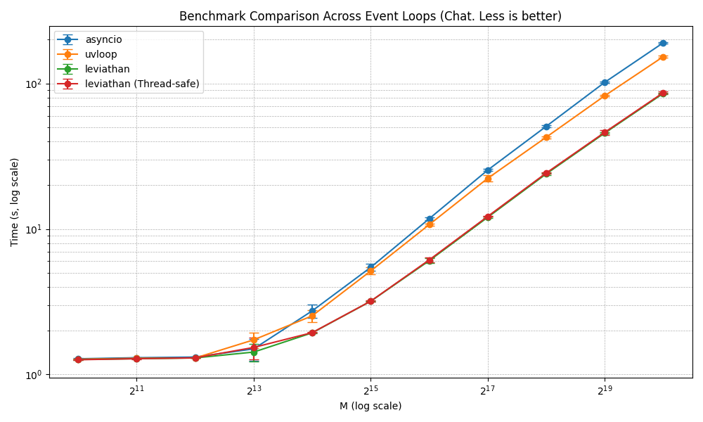

# Leviathan

From the depths of the sea, where darkness meets vastness, emerges Leviathan: an unyielding force of speed and power. In a world where the arcane and the agile intertwine, a loop forged in Python takes its dance. Leviathan, master of the journey, governs events with a steady hand—an **ultra-fast event loop** that deploys its bastion in **asyncio**, powered by the artistry of Zig. Between promises and futures, its path is clear: to rule swiftly where code is prepared.

## 🚀 Features

- **Ultra-fast speed**: Thanks to low-level optimizations enabled by Zig.
- **Full asyncio compatibility**: A drop-in replacement for the default event loop.
- **Efficient design**: Focused on maximizing performance and minimizing latency.
- **Simplicity**: Easy integration with existing Python projects.

## 📜 Requirements

- Python 3.13+
- Zig 0.14.x (for development or contributions)

## 🔧 Installation

To install Leviathan, just execute:

```bash
python setup.py install
```

## 📦 Basic Usage

```python
from leviathan import Loop
import asyncio

async def main():
    print("Hello from Leviathan!")
    await asyncio.sleep(1)
    print("Goodbye from Leviathan!")

loop = Loop()
try:
    loop.run_until_complete(main())
finally:
    loop.close()
```

## 🧪 Benchmarks

Leviathan stands out for its speed and performance. Here is a preliminary chart illustrating its superiority over other event loops:



For more information and additional tests, check the following file: [More benchmarks and details](BENCHMARK.md).

---

⚠️ **Warning**: Leviathan is still under active development. Some integrations, such as full networking support, are pending implementation.

